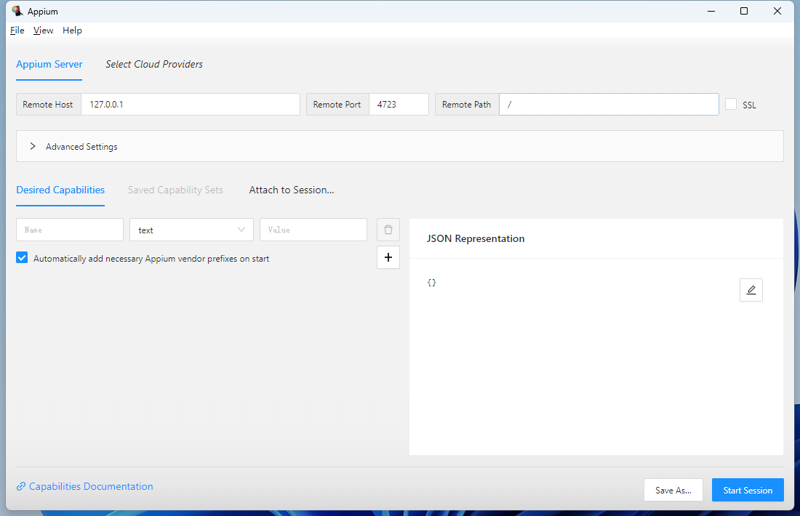
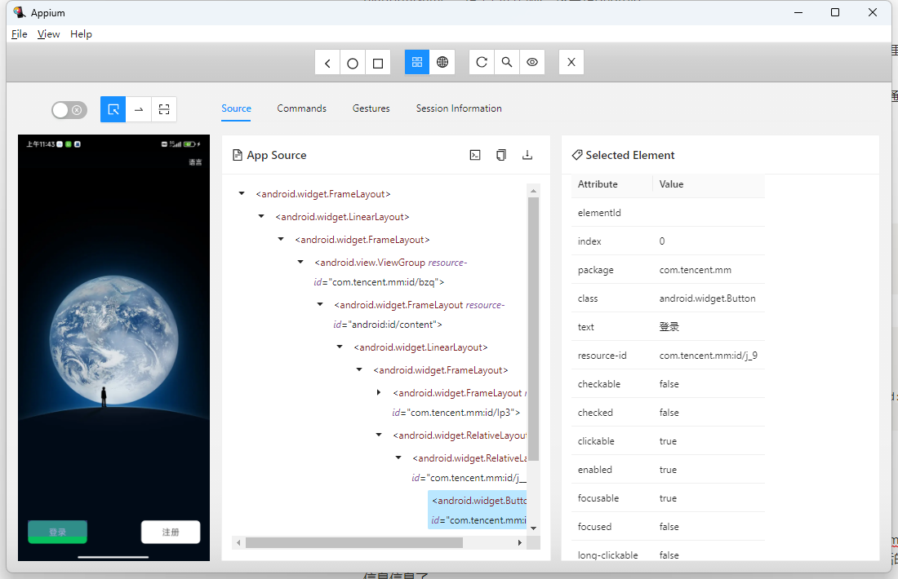
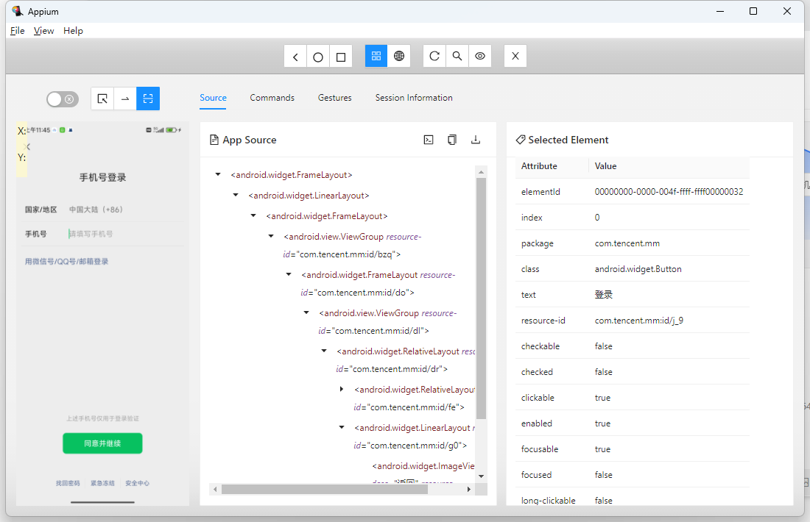

# Android 自动化工具Appium

lorne 2023-08-12

本教程的内容如下：

1. 安装教程说明
2. appium的界面元素操作
3. 自动化测试脚本的编写

## 1. 安装教程

需要安装的环境的有

### 依赖环境

ANDROID_HOME：C:\Users\linqu\AppData\Local\Android\Sdk

PATH：C:\Users\linqu\AppData\Local\Android\Sdk\platform-tools

ANDROID_HOME即SDK的路径，可以通过下载android studio 获取

### 依赖软件

appium

appium是通过nodejs安装的服务，安装指令为

```jsx
npm i --location=global appium
```

安装uiautomator2的驱动

```jsx
appium driver install uiautomator2
```

appium-inspector

appium-inspector 是UI的界面元素提取的软件。

下载地址： https://github.com/appium/appium-inspector/releases

## 2. 使用教程

### 开启appium服务

直接在命令窗口运行如下指令：

```jsx
appium
```

## 打开appium-inspector软件

在桌面快捷方式找到appium-inspector，然后打开软件



Appium Server是配置appium服务的地址信息。

Desired Capabilities是手机启动时需要的参数信息。

```jsx
{
  "appium:automationName": "UiAutomator2",
  "platformName": "Android",
  "appium:deviceName": "ruby",
  "appium:appPackage": "com.tencent.mm",
  "appium:appActivity": ".ui.LauncherUI"
}
```

参数说明：

appium:automationName： 这个参数是来自于appium服务的参数，由于上面安装的UiAutomator2服务决定的，因此也是一个固定值。

platformName： 是平台的名称，这里是Android

appium:appPackage： 是应用程序的包名称，Android的包名称也是应用的唯一标识

appium:appActivity：是应用程序的启动指令，Android对应的就是Activity的启动类名称，这里写作.ui.LauncherUI是省略了包名称的写法。

appium:deviceName：是设备的名称，这个名称当手机打开开发者模式链接到电脑以后可以通过adb指令查看，当然如果是电脑的模拟器的话默认是开着开发者模型的。

### 如何查看device的名称

指令如下:

```jsx
adb devices -l
```

如下是指令执行的结果打印：

```jsx
C:\Users\linqu>adb devices -l
List of devices attached
euqct4tgdefm8xrs       device product:ruby model:22101316C device:ruby transport_id:1
```

其中device的ruby就是设备的deviceName名称。

### 启动appium-inspector软件

当配置好了上述的配置信息以后，点击开始会话，如果手机第一次链接，会下载一个Appiunm Setting的app到手机端，然后配置好以后就可以在appium-inspector界面中看到打开应用以后的画面信息信息了。



在展示界面的上方，有三个按钮，最左侧是查看界面元素，最右侧的按钮是操作。



界面操作交互

## 3. 自动化脚本

基于python的自动化脚本代码，实现对Android手机的设置界面操作

需要安装的依赖如下：

```jsx
Appium-Python-Client
```

代码如下：

```jsx
import json
import unittest
from appium import webdriver
from selenium.webdriver.common.actions.action_builder import ActionBuilder
from appium.webdriver.common.appiumby import AppiumBy
from selenium.webdriver.common.actions import interaction
from selenium.webdriver.common.action_chains import ActionChains
from selenium.webdriver.common.actions.pointer_input import PointerInput

capabilities_json = """
{
    "platformName": "Android",
    "automationName": "uiautomator2",
    "deviceName": "ruby",
    "appPackage": "com.android.settings",
    "appActivity": ".Settings"
}
"""

capabilities = json.loads(capabilities_json)

appium_server_url = 'http://localhost:4723'

class TestAppium(unittest.TestCase):
    def setUp(self) -> None:
        self.driver = webdriver.Remote(appium_server_url, capabilities)
        # 获取屏幕尺寸
        size = self.driver.get_window_size()
        self.width = size['width']
        self.height = size['height']

    def tearDown(self) -> None:
				# 退出
        if self.driver:
            self.driver.quit()

    def test_find_battery(self) -> None:
        # 获取列表的名称信息
        el = self.driver.find_element(by=AppiumBy.ID, value='com.android.settings:id/scroll_headers')
        elements = el.find_elements(by=AppiumBy.CLASS_NAME, value='android.widget.TextView')
        for element in elements:
            print(element.text)

        # 查找并点击电池选项
        el = self.driver.find_element(by=AppiumBy.ID, value='android:id/input')
        el.click()

        search = self.driver.find_element(by=AppiumBy.ID, value='android:id/input')
        search.send_keys('设置')

        self.driver.back()

        # 计算滑动的起始和结束点
        start_x = self.width // 2
        start_y = self.height // 2
        end_x = start_x
        end_y = start_y - self.height // 2

        actions = ActionChains(self.driver)
        actions.w3c_actions = ActionBuilder(self.driver, mouse=PointerInput(interaction.POINTER_TOUCH, "touch"))
        actions.w3c_actions.pointer_action.move_to_location(start_x, start_y)
        actions.w3c_actions.pointer_action.pointer_down()
        actions.w3c_actions.pointer_action.pause(2)
        actions.w3c_actions.pointer_action.move_to_location(end_x, end_y)
        actions.w3c_actions.pointer_action.release()
        actions.perform()

        # 查找并点击电池选项
        el = self.driver.find_element(by=AppiumBy.XPATH, value='//*[@text="更多设置"]')
        el.click()

        # 返回上一级
        self.driver.back()

if __name__ == '__main__':
    unittest.main()
```

Appium也支持 Java、JS、Ruby等开发语言的自动化脚本支持。

## 参考资料
[https://github.com/appium/appium-inspector/releases](https://github.com/appium/appium-inspector/releases)
[Install Appium - Appium Documentation](http://appium.io/docs/en/2.0/quickstart/install/)
[Write a Test (Python) - Appium Documentation](http://appium.io/docs/en/2.0/quickstart/test-py/)